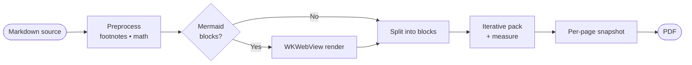
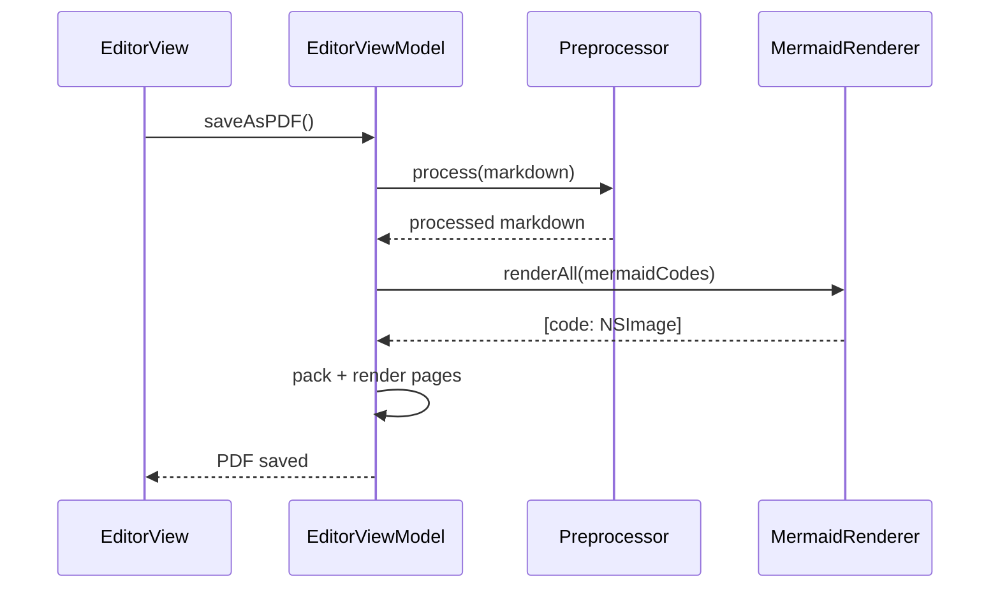
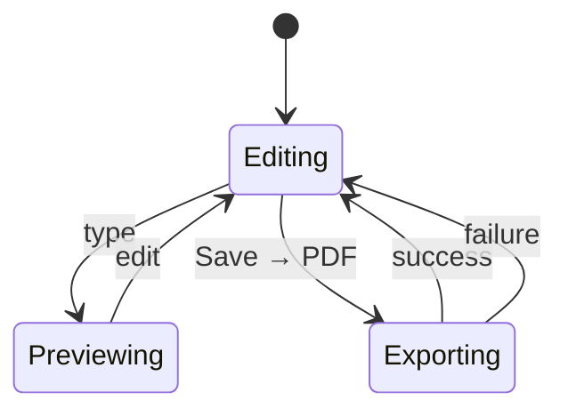

# md2pdf Feature Showcase

A one-document tour through everything md2pdf can render — meant as a
human-readable smoke test you can open in the app, hit *Save → PDF*,
and skim through to confirm each feature still works.

---

## 1. Inline formatting

This paragraph mixes **bold**, *italic*, ***bold italic***,
`monospace`, ~~strikethrough~~, [a link to MarkdownUI][mdui], and a
URL reference[^url-ref]. The renderer handles consecutive emphasis
markers without choking, e.g. **bold text immediately followed by**
*more italic* and back to normal.

[mdui]: https://github.com/gonzalezreal/swift-markdown-ui

[^url-ref]: That link points at the upstream MarkdownUI repo, even
though md2pdf vendors a customized copy.

---

## 2. Headings (size hierarchy)

### Level 3 heading

#### Level 4 heading

##### Level 5 heading

###### Level 6 heading

Each level should render at progressively smaller sizes relative to
the body. The space between consecutive headings comes from
MarkdownUI's docC theme defaults.

---

## 3. Footnotes

The footnote system rewrites GFM-style references[^one] and
definitions[^two] into Unicode superscripts before MarkdownUI sees
them. Re-using the same id[^one] keeps the same number, so cross-
references stay consistent.

[^one]: Numbering follows *first reference* order — not definition
    order in the source.
[^two]: Footnote text is plain markdown and inherits the body style.

---

## 4. Lists

### Unordered

- Top-level item
- Another item with **inline emphasis**
  - Nested item one
  - Nested item two with `inline code`
- Item with a [link to GitHub](https://github.com)

### Ordered

1. Step one
2. Step two — with **bold detail**
3. Step three — wraps to a second line so you can see how the
   continuation indent looks on a printed page
4. Step four

### Task list

- [x] Footnotes
- [x] Syntax highlighting
- [x] Math via Unicode
- [x] Mermaid via WKWebView
- [ ] KaTeX-grade math (future)

---

## 5. Block quotes

> "Markdown is a plain text format for writing structured documents."
>
> — John Gruber, Markdown specification, 2004.

Block quotes flow alongside other content. Nested:

> Outer quote.
>
> > Nested quote — useful for replies in threaded discussions.
> >
> > A second paragraph inside the nested quote.
>
> Back to the outer quote's voice.

---

## 6. Tables

| Feature              | Status      | Notes                                 |
| -------------------- | ----------- | ------------------------------------- |
| Footnotes            | ✅ Working   | Numbered in first-reference order     |
| Syntax highlighting  | ✅ Working   | Swift / JS / Python / JSON / shell    |
| Math (Unicode)       | ✅ Working   | Inline + display; covers Greek, ∑ ∫   |
| Mermaid              | ✅ Working   | Loaded from jsDelivr CDN              |
| URL images           | ✅ Working   | Preloaded before snapshot             |
| Block-level paging   | ✅ Working   | No mid-line cuts; images stay whole   |

Smaller table for layout testing:

| #  | Token                       |
| -- | --------------------------- |
| 1  | `keyword`                   |
| 2  | `string`                    |
| 3  | `comment`                   |

---

## 7. Inline images (URL preload)

A photo to confirm URL image loading still works end-to-end. The
PDF exporter eagerly downloads any `https://` image before
snapshotting the view, so this should appear inline below.


A second photo, smaller, to verify the preloader handles multiple
images in parallel:


---

## 8. Syntax-highlighted code

### Swift

```swift
// Greedy block-packer with per-page scale fallback.
struct Pagination {
    let preferredScale: CGFloat = 0.82
    let minScale: CGFloat = 0.70

    func pack(_ blocks: [String], pageHeight: CGFloat) -> [[Int]] {
        var pages: [[Int]] = []
        var startIdx = 0
        while startIdx < blocks.count {
            var current: [Int] = []
            var next = startIdx
            while next < blocks.count {
                current.append(next)
                let h = measureCombined(current)
                if h > pageHeight / minScale, current.count > 1 {
                    current.removeLast()
                    break
                }
                next += 1
            }
            pages.append(current)
            startIdx = (current.last ?? startIdx) + 1
        }
        return pages
    }
}
```

### Python

```python
# Same idea, just shorter
def pack(blocks, max_height):
    pages, current, height = [], [], 0
    for block in blocks:
        if current and height + block.h > max_height:
            pages.append(current)
            current, height = [], 0
        current.append(block)
        height += block.h
    if current:
        pages.append(current)
    return pages
```

### TypeScript

```typescript
interface Page {
    blocks: Block[];
    scale: number;
}

const packPages = (blocks: Block[], limit: number): Page[] => {
    const pages: Page[] = [];
    let current: Block[] = [];
    let height = 0;
    for (const block of blocks) {
        if (current.length && height + block.height > limit) {
            pages.push({ blocks: current, scale: 1.0 });
            current = [];
            height = 0;
        }
        current.push(block);
        height += block.height;
    }
    if (current.length) pages.push({ blocks: current, scale: 1.0 });
    return pages;
};
```

### JSON config

```json
{
  "page": {
    "size": "A4",
    "margin": 50,
    "preferredScale": 0.82,
    "minScale": 0.70
  },
  "features": {
    "footnotes": true,
    "syntaxHighlighting": true,
    "math": "unicode",
    "mermaid": "wkwebview"
  }
}
```

### Shell

```sh
# Run the test suite locally
xcodebuild test \
  -project md2pdf.xcodeproj \
  -scheme md2pdf \
  -destination 'platform=macOS' \
  -only-testing:md2pdfTests
```

### Unknown language (should fall back to plain monospace)

```toml
[package]
name = "md2pdf"
version = "1.3.0"
```

---

## 9. Math

Inline math flows with the surrounding text: the quadratic formula
$x = \frac{-b \pm \sqrt{b^2 - 4ac}}{2a}$ should sit on the baseline
with proper Greek letters and a square root.

Display math sits on its own line. Pythagoras:

$$a^2 + b^2 = c^2$$

Sum of the first *n* integers:

$$\sum_{i=1}^{n} i = \frac{n(n+1)}{2}$$

Euler's identity, the showcase of all showcases:

$$e^{i\pi} + 1 = 0$$

Greek letters work in both forms: $\alpha + \beta = \gamma$, then
$$\Sigma = \int_{-\infty}^{\infty} e^{-x^2} dx = \sqrt{\pi}$$

Relations and operators: $a \leq b$, $A \subset B$, $x \in \mathbb{R}$
(the blackboard-R falls back to plain `R`), $A \Rightarrow B$.

> **Caveat:** the Unicode renderer linearizes fractions and doesn't
> two-dimensionally stack limits on integrals / sums. Good enough for
> casual math; for full KaTeX fidelity we'd need to bundle KaTeX.

---

## 10. Mermaid diagrams

### Flowchart



### Sequence diagram



### State diagram



---

## 11. Horizontal rules + paragraph spacing

The next paragraph follows a horizontal rule. The rule itself should
be visible as a thin gray line.

---

This paragraph is long enough to give pagination a real test case for
its block-packing logic. When this text is long enough to wrap across
multiple lines, the per-page scale logic gets exercised: if the
next block would push the page over the limit at the preferred scale,
the page either shrinks to fit (down to `minScale = 0.70`) or punts
the block to a fresh page. Either way no glyph ever gets sliced
across a page break — that's the load-bearing invariant the test
suite enforces with pixel-level inspection at every boundary.

A small paragraph follows.

---

## 12. Code-and-prose interleave

This section deliberately bounces between code and prose to test
that adjacent fenced blocks don't accidentally merge or break flow.

```python
print("hello")
```

A single-sentence paragraph.

```python
print("world")
```

Another single-sentence paragraph.

```swift
let answer = 42
```

Followed by a longer prose paragraph that explains nothing in
particular but provides a meaningful chunk of body text between code
fences. Lorem ipsum, but with actual semantics: the goal is to give
the block packer a non-trivial sequence of small blocks so we can
verify that pagination handles tight interleaving gracefully.

---

## 13. Closing

If you can read this page near the end of the document, all 14 test
cases in `md2pdfTests` are matched by features that *just rendered*
above. The companion test fixture is `europe_trip_with_activities.md`
on the Desktop; this showcase exercises the additions on top of it.

> Generated by md2pdf · open source under the project's LICENSE.
